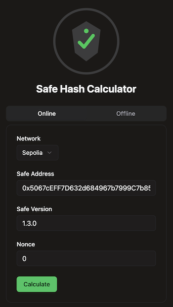
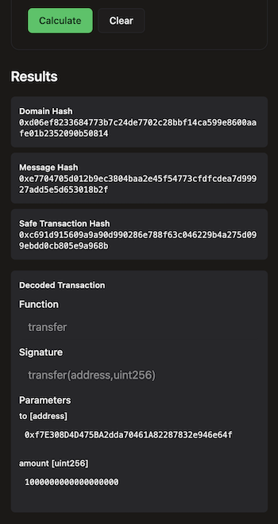

# Safe Transaction Hash Verifier Extension

  

A Chrome browser extension for verifying Safe multi-signature wallet transactions. This extension allows users to independently calculate and verify transaction hashes for Ethereum Safe (formerly Gnosis Safe) transactions.

## License

## Why use this extension

Safe multi-signature wallets are designed to secure digital assets by requiring multiple signatures before executing transactions. However, transaction details displayed on Safe's interface could potentially be manipulated in the unlikely event of a compromised frontend. This extension provides an independent verification layer by calculating transaction hashes locally using the same cryptographic methods as Safe contracts. By comparing your extension-calculated hash with the one shown on Safe's interface, you can verify transaction integrity before signing, protecting against potential frontend attacks or manipulation. This is especially valuable for high-value transactions or organizations managing significant treasury funds.

## Screenshots

  

    
  

  

    
  

## Contents

- [Safe Transaction Hash Verifier Extension](#safe-transaction-hash-verifier-extension)
  - [License](#license)
  - [Why use this extension](#why-use-this-extension)
  - [Screenshots](#screenshots)
  - [Contents](#contents)
  - [Features](#features)
  - [Limitations](#limitations)
  - [Installation](#installation)
    - [Chrome Web Store](#chrome-web-store)
    - [Manual Installation](#manual-installation)
  - [Usage](#usage)
  - [Project Structure](#project-structure)
  - [How It Works](#how-it-works)
  - [Inspiration](#inspiration)
  - [Disclaimer](#disclaimer)

## Features

- Calculate and verify Safe transaction hashes
- Support for various Safe versions (1.0.0 to 1.3.0)
- Support for nested Safe transactions
- Security warnings for potentially risky transactions
- Support for multiple Ethereum networks
- Browser extension that integrates with Safe web interface

## Limitations

- Chains supported at the moment: `sepolia`, `ethereum`, `arbitrum` and `base`.
- If the smart contract has a proxy at the moment decoding the implementation transaction only supports EIP-1967 Transparent Proxy implementations.

## Installation

### Chrome Web Store

_(Coming soon)_

### Manual Installation

1. Download the latest release from the repository
2. In Chrome, go to `chrome://extensions/`
3. Enable "Developer mode"
4. Click "Load unpacked" and select the extension directory

## Usage

1. Navigate to a Safe transaction page at safe.global
2. Click the extension icon or use the keyboard shortcut (Ctrl+B/Command+B)
3. The extension will automatically detect your Safe address and network
4. Enter the transaction nonce and Safe version (defaults to 1.3.0)
5. Click "Calculate" to verify the transaction hash
6. Compare the result with the hash shown on your wallet interface
   > [!IMPORTANT]
   > Also compare the Safe interface, seeing a difference there could mean the front end is compromised.

## Project Structure

- `/extension` - Chrome extension source code and build tools
- `/infra` - AWS CDK infrastructure for backend services
- `/lambda` - AWS Lambda function for fetching contract ABIs

## How It Works

The extension works in two modes:

- **Online mode**: Provide your Safe address, network, and transaction nonce. The extension fetches transaction details from the Safe API.
- **Offline mode**: Manually enter all transaction details for complete independence from external services.

When calculating a hash, the extension:

1. Retrieves or uses the transaction data provided
2. Applies the same mathematical formulas Safe uses to calculate transaction hashes
3. Shows results with any security warnings for risky transactions
4. Decodes the transaction data when possible to display the actual transaction purpose

## Inspiration

This project was inspired by [safe-tx-hashes-util](https://github.com/pcaversaccio/safe-tx-hashes-util) created by [pcaversaccio](https://github.com/pcaversaccio). The original utility provided the foundation for transaction hash verification that has been evolved into this browser extension.

## Disclaimer

This extension is provided "as is" without warranties of any kind. It is not officially affiliated with or endorsed by Safe (formerly Gnosis Safe). While every effort has been made to ensure accuracy, the authors assume no responsibility for errors, financial losses, or damages arising from the use of this extension. Users should always exercise caution when signing blockchain transactions. This tool is meant as an additional security measure, not a replacement for standard security practices. The codebase is open source and community contributions to improve its security and functionality are welcome.
